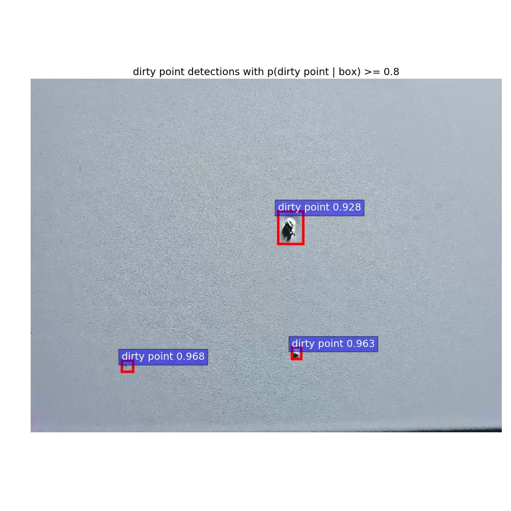
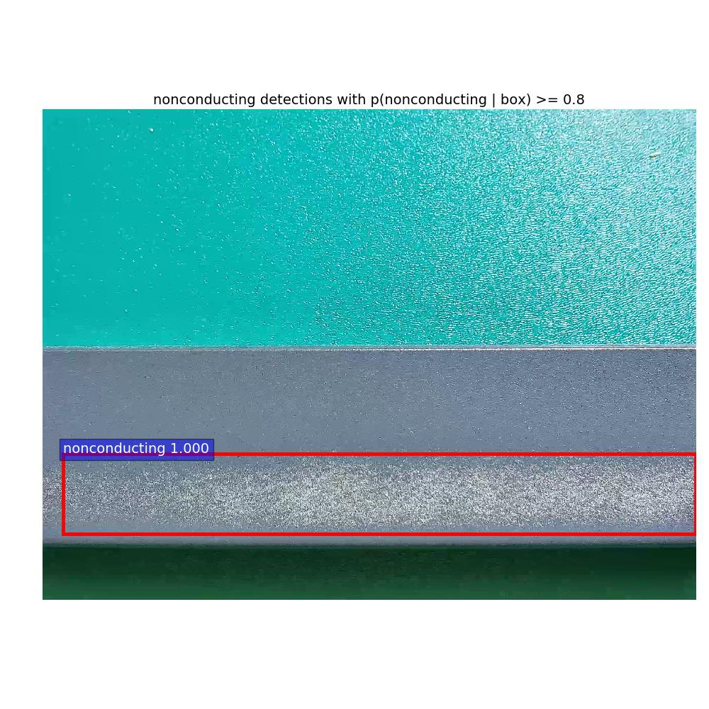

# Note
My code is changed from detectron framework. For more details about detectron, plz refer to the [original link](https://github.com/facebookresearch/detectron) 

Below is an example of detected dirty-point img.
<div align="center">
  
  <p>Example defect(dirty point) output.</p>
</div>
<div align="center">
  
  <p>Example defect(non-conducting) output.</p>
</div>

# Detectron

Detectron is Facebook AI Research's software system that implements state-of-the-art object detection algorithms, including [Mask R-CNN](https://arxiv.org/abs/1703.06870). It is written in Python and powered by the [Caffe2](https://github.com/caffe2/caffe2) deep learning framework.


## License

Detectron is released under the [Apache 2.0 license](https://github.com/facebookresearch/detectron/blob/master/LICENSE). See the [NOTICE](https://github.com/facebookresearch/detectron/blob/master/NOTICE) file for additional details.

## Citing Detectron

If you use Detectron in your research or wish to refer to the baseline results published in the [Model Zoo](MODEL_ZOO.md), please use the following BibTeX entry.

```
@misc{Detectron2018,
  author =       {Ross Girshick and Ilija Radosavovic and Georgia Gkioxari and
                  Piotr Doll\'{a}r and Kaiming He},
  title =        {Detectron},
  howpublished = {\url{https://github.com/facebookresearch/detectron}},
  year =         {2018}
}
```


